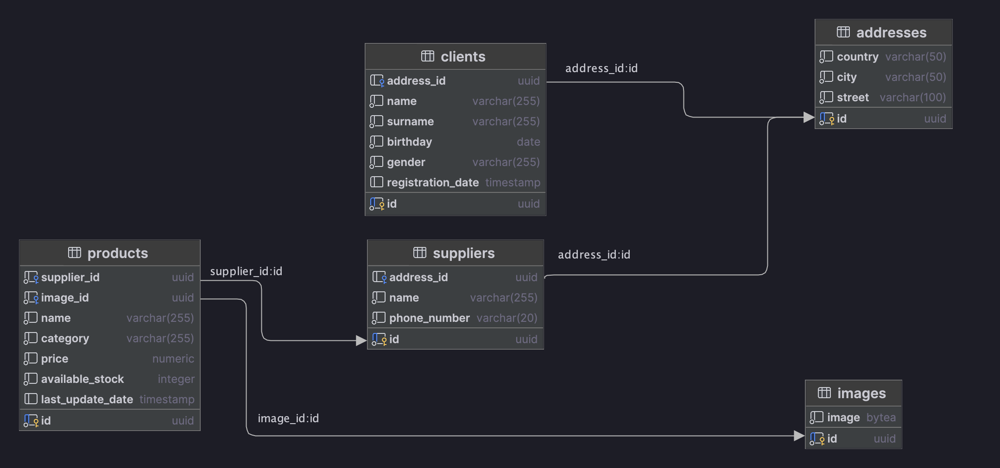

# Shop - Магазин

## Содержание

- [Описание](#описание)
- [Структура данных](#структура-данных)
- [Запуск проекта](#запуск-проекта)
- [Настройки Nginx](#настройки-nginx)
    - [Общие настройки](#общие-настройки)
    - [Доступ к API](#доступ-к-api)
    - [Доступ к pgAdmin](#доступ-к-pgadmin)
    - [Мониторинг](#мониторинг)
- [Swagger документация](#swagger-документация)
- [Описание API](#описание-api)
    - [Клиенты](#клиенты)
    - [Поставщики](#поставщики)
    - [Изображения](#изображения)
    - [Товары](#товары)
- [Интеграционные тесты](#интеграционные-тесты)

## Описание

Shop — это RESTful API для онлайн-магазина, предоставляющее доступ к управлению клиентами, товарами, поставщиками и
изображениями товаров. API поддерживает основные HTTP-методы (GET, POST, PUT, DELETE, PATCH) и использует реляционную
модель данных, реализованную в PostgreSQL.

### Особенности

Проект спроектирован с использованием нормальных форм и реализует паттерн Repository для доступа к данным.

В проекте реализован scheduler который каждый 10 минут удаляет не используемые категории из базы данных.   
Время запуска scheduler можно изменить в файле docker-compose.yml в секции environment ${CATEGORIES_SCHEDULER_CRON}.

Для раздачи статического контента и балансировки нагрузки используется Nginx.  
Nginx настроен как reverse proxy, перенаправляющий запросы к API.  
Конфигурация Nginx позволяет кэшировать статические файлы и оптимизировать производительность API.

## Структура данных

База данных для сервиса схематически выглядит так:


## Запуск проекта

Перед запуском проекта необходимо настроить локальные доменные имена shop.ru и www.shop.ru, чтобы они указывали на ваш
компьютер (локальный сервер).  
Для этого добавьте в файл hosts следующую запись:

```bash
127.0.0.1 shop.ru www.shop.ru
```

🔗 [Настройка hosts на macOS](https://help.reg.ru/support/dns-servery-i-nastroyka-zony/rabota-s-dns-serverami/fayl-hosts-na-macos#0)  
🔗 [Настройка hosts на Windows](https://help.reg.ru/support/dns-servery-i-nastroyka-zony/rabota-s-dns-serverami/fayl-hosts-dlya-windows-10#0)

Проект может быть запущен в Docker-контейнере с помощью команды:

```bash
docker compose up --build
```

## Настройки Nginx

### Общие настройки

- Nginx настроен на работу по HTTPS.
- Включено gzip-сжатие.

### Доступ к API

- Основной API: https://shop.ru/api/ — доступны все эндпоинты.
- Версия API v2: https://shop.ru/api/v2/
    - Доступны только GET-запросы.
    - Ответы 200, 301, 302 кешируются на 5 минут, 404 на 1 минуту.
    - Балансировка нагрузки между 3-мя бэкенд-серверами в соотношении 2:1:1, где первый — основной сервер.

### Доступ к pgAdmin

- URL: https://shop.ru/admin
- Логин: pgadmin@example.com
- Пароль: admin

### Мониторинг

- По пути https://shop.ru/api/status доступен статус сервера Nginx.

## Swagger документация

После запуска проекта API поддерживает документацию Swagger.   
Для доступа к Swagger UI используйте: https://shop.ru/api/v1  
После открытия страницы в поисковике введите /api-docs/swagger-config и нажмите Explore.

## Описание API

### Клиенты

- **GET https://shop.ru/api/clients** - Получение клиентов по имени и фамилии (параметры — name и surname)
- **GET https://shop.ru/api/clients** - Получение всех клиентов (В данном запросе необходимо предусмотреть опциональные
  параметры
  пагинации в строке запроса: limit и offset). В случае отсутствия эти параметров возвращать весь список.
- **DELETE https://shop.ru/api/clients/{id}** - Удаление клиента (по его идентификатору)
- **PUT https://shop.ru/api/clients/{id}** - Изменение клиента (по его идентификатору) или создание нового если его не
  существует.
- **PATCH https://shop.ru/api/clients/{id}** - Частичное изменение клиента (по его идентификатору).
- **POST https://shop.ru/api/clients** - Добавление клиента (на вход подается json, соответствующей структуре, описанной
  ниже).
  ```json
  {
      "name": "John",
      "surname": "Doe",
      "birthday": "1985-05-15",
      "gender": "male",
      "address": {
          "country": "USA",
          "city": "New York",
          "street": "5th Avenue"
      }
  }
- **Валидация**: Все обязательные поля (name, surname, birthday, gender, address) должны быть указаны. Формат даты и
  другие поля должны соответствовать ожидаемому формату. В случае ошибки валидации возвращается код ошибки 400.

### Поставщики

- **GET https://shop.ru/api/suppliers** - Получение всех поставщиков
- **GET https://shop.ru/api/suppliers/{id}** - Получение поставщика (по его идентификатору).
- **PUT https://shop.ru/api/suppliers/{id}** - Изменение поставщика (по его идентификатору) или создание нового если его не
  существует.
- **PATCH https://shop.ru/api/suppliers/{id}** - Частичное изменение поставщика (по его идентификатору).
- **DELETE https://shop.ru/api/suppliers/{id}** - Удаление поставщика  (по его идентификатору).
- **POST https://shop.ru/api/suppliers** - Добавление поставщика (на вход подается json, соответствующей структуре,
  описанной ниже).
  ```json
  {
    "name": "Igor",
    "phone_number": "8(927)777-77-77",
    "address": {
        "country":"Russia",
        "city":"Kazan",
        "street":"Derzhavina 2"        
    }  
- **Валидация**: Все обязательные поля (name, phone_number, address) должны быть указаны. Формат данных, включая номер
  телефона и адрес, должен быть корректным. В случае ошибки валидации возвращается код ошибки 400.

### Изображения

- **GET https://shop.ru/api/images/{id}** - Получение изображения (по его идентификатору)
- **PUT https://shop.ru/api/images/{id}** - Изменение изображения (по его идентификатору) или создание нового если его не
  существует.
- **DELETE https://shop.ru/api/images/{id}** - Удаление изображения (по его идентификатору)
- **POST https://shop.ru/api/images** - Добавление изображения (на вход подается byte array изображения, **Body ->
  form-data,
  Key=file**).
- **Валидация**: Обязательное поле (file). Файл не должен быть пустым. В случае ошибки валидации возвращается код ошибки 400.


### Товары

- **GET https://shop.ru/api/products/{id}** - Получение товара (по его идентификатору)
- **GET https://shop.ru/api/products** - Получение всех доступных товаров
- **GET https://shop.ru/api/products/image{id}** - Получение изображения конкретного товара (по идентификатору товара)
- **PATCH https://shop.ru/api/products/amount/{id}** - Уменьшение количества товара (по его идентификатору)
- **PATCH https://shop.ru/api/products/{id}** - Частичное изменение продукта (по его идентификатору)
- **PUT https://shop.ru/api/products/{id}** - Изменение продукта (по его идентификатору) или создание нового если его не
  существует.
- **DELETE https://shop.ru/api/products/{id}** - Удаление товара (по его идентификатору)
- **POST https://shop.ru/api/products** - Добавление товара (на вход подается json, соответствующей структуре, описанной
  ниже).
  ```json
  {
    "name":"Iphone 13",
    "category":"phone",
    "price":1000.99,
    "available_stock":30,
    "image_id":"3cbd91f3-17d1-4969-bd30-d444f8b50504",
    "supplier_id":"4e8b692b-2ad9-4e5b-a893-5df5e0d12d0d"
  }
- **Валидация**: Все обязательные поля (name, category, price, available_stock, image_id, supplier_id) должны быть
  указаны. Объекты image_id, supplier_id должны существовать в базе данных. В случае ошибки валидации возвращается код
  ошибки 400.

## Интеграционные тесты

Для ручных проверок API в директории data-samples подготовлена коллекция Postman для всех эндпоинтов.  
Реализованы интеграционные тесты, которые проверяют работоспособность API для каждого эндпоинта.  
Для запуска интеграционных тестов используется команда:

```bash
mvn test
```
