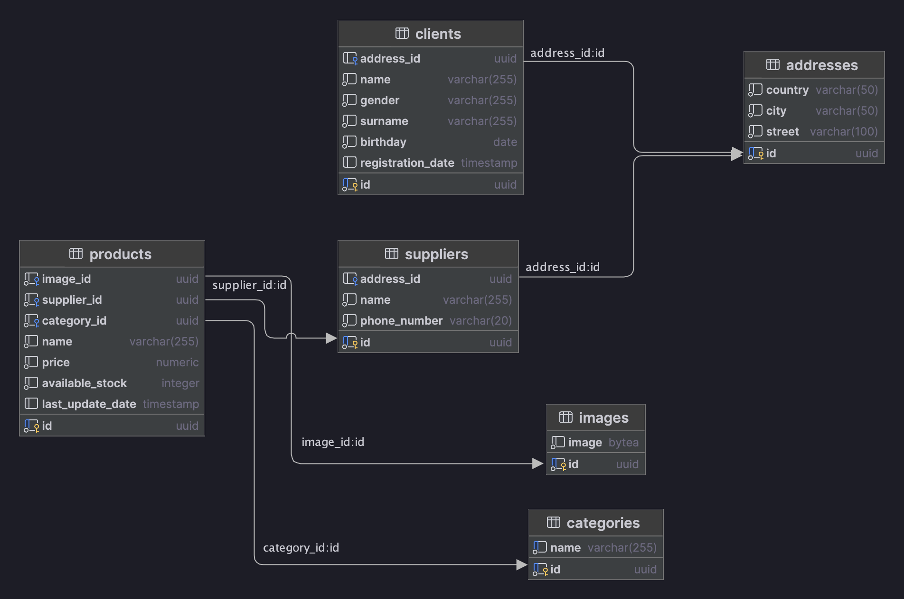

# Shop - Магазин

## Содержание

- [Описание](#описание)
- [Структура данных](#структура-данных)
- [Запуск проекта](#запуск-проекта)
- [Swagger документация](#swagger-документация)
- [Описание API](#описание-api)
    - [Клиенты](#клиенты)
    - [Поставщики](#поставщики)
    - [Изображения](#изображения)
    - [Товары](#товары)
- [Интеграционные тесты](#интеграционные-тесты)

## Описание

Shop — это RESTful API для онлайн-магазина, предоставляющее доступ к управлению клиентами, товарами, поставщиками и
изображениями товаров. API поддерживает основные HTTP-методы (GET, POST, PUT, DELETE, PATCH) и использует реляционную
модель данных, реализованную в PostgreSQL.

### Особенности

Проект спроектирован с использованием нормальных форм и реализует паттерн Repository для доступа к данным.

В проекте реализован scheduler который каждый 10 минут удаляет не используемые категории из базы данных.   
Время запуска scheduler можно изменить в файле application.properties, изменив секцию scheduler.categories.cleanup.cron.

## Структура данных

База данных для сервиса схематически выглядит так:


## Запуск проекта

Проект может быть запущен в Docker-контейнере с помощью команды:

```bash
docker compose up --build
```

## Swagger документация

После запуска проекта API поддерживает документацию Swagger. Для доступа к Swagger UI используйте:  
http://localhost:8080/swagger/index.html

## Описание API

### Клиенты

- **GET /api/v1/clients** - Получение клиентов по имени и фамилии (параметры — name и surname)
- **GET /api/v1/clients** - Получение всех клиентов (В данном запросе необходимо предусмотреть опциональные параметры
  пагинации в строке запроса: limit и offset). В случае отсутствия эти параметров возвращать весь список.
- **DELETE /api/v1/clients/{id}** - Удаление клиента (по его идентификатору)
- **PUT /api/v1/clients/{id}** - Изменение клиента (по его идентификатору) или создание нового если его не
  существует.
- **PATCH /api/v1/clients/{id}** - Частичное изменение клиента (по его идентификатору).
- **POST /api/v1/clients** - Добавление клиента (на вход подается json, соответствующей структуре, описанной ниже).
  ```json
  {
      "name": "John",
      "surname": "Doe",
      "birthday": "1985-05-15",
      "gender": "male",
      "address": {
          "country": "USA",
          "city": "New York",
          "street": "5th Avenue"
      }
  }
- **Валидация**: Все обязательные поля (name, surname, birthday, gender, address) должны быть указаны. Формат даты и
  другие поля должны соответствовать ожидаемому формату. В случае ошибки валидации возвращается код ошибки 400.

### Поставщики

- **GET /api/v1/suppliers** - Получение всех поставщиков
- **GET /api/v1/suppliers/{id}** - Получение поставщика (по его идентификатору).
- **PUT /api/v1/suppliers/{id}** - Изменение поставщика (по его идентификатору) или создание нового если его не
  существует.
- **PATCH /api/v1/suppliers/{id}** - Частичное изменение поставщика (по его идентификатору).
- **DELETE /api/v1/suppliers/{id}** - Удаление поставщика  (по его идентификатору).
- **POST /api/v1/suppliers** - Добавление поставщика (на вход подается json, соответствующей структуре, описанной ниже).
  ```json
  {
    "name": "Igor",
    "phone_number": "8(927)777-77-77",
    "address": {
        "country":"Russia",
        "city":"Kazan",
        "street":"Derzhavina 2"        
    }  
- **Валидация**: Все обязательные поля (name, phone_number, address) должны быть указаны. Формат данных, включая номер
  телефона и адрес, должен быть корректным. В случае ошибки валидации возвращается код ошибки 400.

### Изображения

- **GET /api/v1/images/{id}** - Получение изображения (по его идентификатору)
- **PUT /api/v1/images/{id}** - Изменение изображения (по его идентификатору) или создание нового если его не
  существует.
- **DELETE /api/v1/images/{id}** - Удаление изображения (по его идентификатору)
- **POST /api/v1/images** - Добавление изображения (на вход подается byte array изображения, **Body -> form-data,
  Key=file**).
- **Валидация**: Обязательное поле (file). Файл не должен быть пустым. В случае ошибки валидации возвращается код ошибки
    400.

### Товары

- **GET /api/v1/products/{id}** - Получение товара (по его идентификатору)
- **GET /api/v1/products** - Получение всех доступных товаров
- **GET /api/v1/products/image{id}** - Получение изображения конкретного товара (по идентификатору товара)
- **PATCH /api/v1/products/amount/{id}** - Уменьшение количества товара (по его идентификатору)
- **PATCH /api/v1/products/{id}** - Частичное изменение продукта (по его идентификатору)
- **PUT /api/v1/products/{id}** - Изменение продукта (по его идентификатору) или создание нового если его не
  существует.
- **DELETE /api/v1/products/{id}** - Удаление товара (по его идентификатору)
- **POST /api/v1/products** - Добавление товара (на вход подается json, соответствующей структуре, описанной ниже).
  ```json
  {
    "name":"Iphone 13",
    "category":"phone",
    "price":1000.99,
    "available_stock":30,
    "image_id":"3cbd91f3-17d1-4969-bd30-d444f8b50504",
    "supplier_id":"4e8b692b-2ad9-4e5b-a893-5df5e0d12d0d"
  }
- **Валидация**: Все обязательные поля (name, category, price, available_stock, image_id, supplier_id) должны быть
  указаны. Объекты image_id, supplier_id должны существовать в базе данных. В случае ошибки валидации возвращается код
  ошибки 400.

## Интеграционные тесты

Реализованы интеграционные тесты, которые проверяют работоспособность API для каждого эндпоинта.  
Для запуска интеграционных тестов используется команда:

```bash
mvn test
```
